## phase 1


1A
```
make test_objects
./test_objects
```


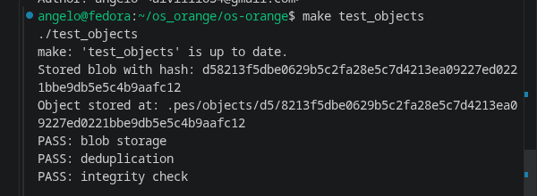

1B
```
find .pes/objects -type f
```
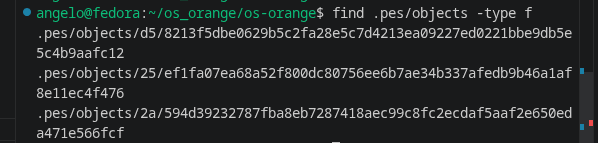


## phase 2

2A

```
make test_tree
./test_tree

```
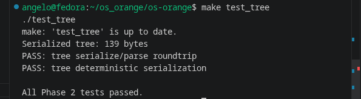

2B
```
xxd .pes/objects/XX/YYYY... | head -20
```

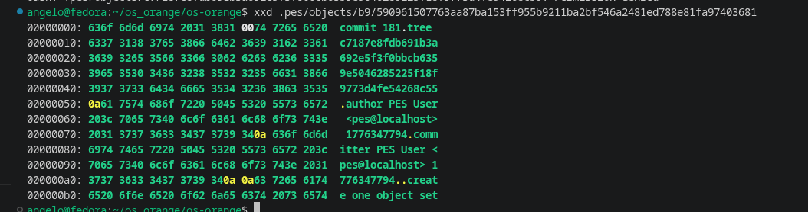

## phase 3

3A
```
./pes init, ./pes add file1.txt file2.txt, ./pes status
```
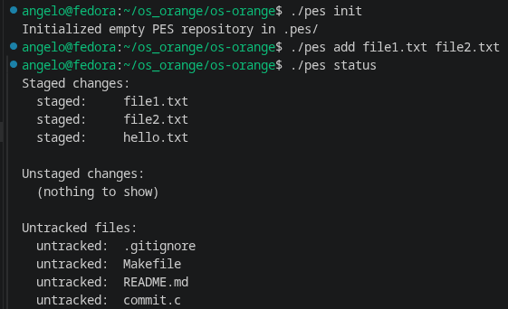

3B

```
cat .pes/index

```
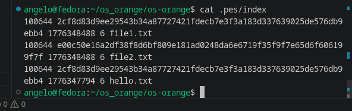


## phase 4

4A
```
./pes log 
```

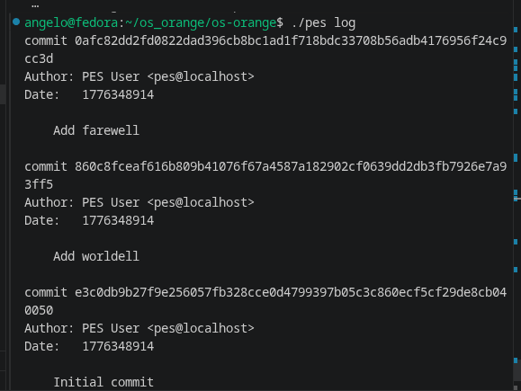

4B

```
find .pes -type f | sort
```
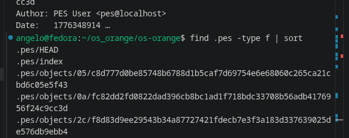

4C

```
cat .pes/refs/heads/main
cat .pes/HEAD
```
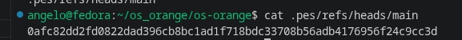
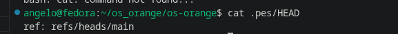


## final

```
make test-integration
```
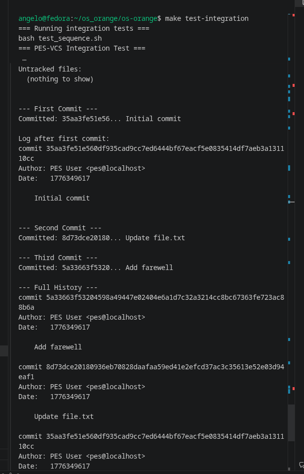

## phase 5 and 6 analysis answers

### Q5.1 checkout branch design

To implement `pes checkout <branch>`, the repository state and working directory must both change.

Files to read/update in `.pes/`:
- Read `.pes/refs/heads/<branch>` to get the target commit hash.
- Update `.pes/HEAD` to `ref: refs/heads/<branch>` (if checking out a branch name).
- Rebuild `.pes/index` so it matches the checked-out commit tree metadata.

Working directory actions:
- Resolve target commit -> root tree.
- Materialize that tree into files/directories in the working directory.
- Update files that differ, create files that are missing, and remove tracked files that are not present in target tree.
- Preserve or reject conflicting local changes before writing.

Why this is complex:
- You must safely map between three states: HEAD commit snapshot, index snapshot, and live filesystem.
- Path-level conflicts exist (file-vs-directory swaps, deletions, renames represented as add+delete).
- Checkout must be atomic enough to avoid partial repository states on failure.
- Uncommitted changes can overlap with target branch changes and must be detected before overwrite.

### Q5.2 dirty working directory conflict detection

Using only index + object store, detect conflicts as follows:

1. Read current branch commit tree (source) and target branch commit tree.
2. Build path maps for tracked files in source and target with blob hashes.
3. For each path tracked in current branch:
	- Compare filesystem metadata/content with index entry.
	- If mtime/size differ from index, re-hash file and compare with index blob hash from object store.
	- If hash differs, file is dirty locally.
4. For each dirty path, check whether source-vs-target blob hash differs.
	- If target also changes that path, checkout must refuse (would overwrite local uncommitted work).
5. Also reject if path-type conflicts occur (file in one branch, directory in the other) and local path is dirty.

Rule summary: refuse checkout when `(locally modified tracked path) AND (path content/type changes between branches)`.

### Q5.3 detached HEAD commits

In detached HEAD, `HEAD` stores a commit hash directly instead of a branch ref.

What happens when committing:
- New commits are created normally.
- `HEAD` moves to the new commit hash.
- No branch name is updated, so those commits are easy to lose when switching away.

How to recover:
- Create a branch at the detached tip before leaving it (for example, `refs/heads/recovered`).
- Or find the commit from reflog/history and then create a branch pointing to that hash.

### Q6.1 unreachable object collection

Mark-and-sweep algorithm:

1. Enumerate roots: all branch heads in `.pes/refs/heads/*` (and optional tags if implemented).
2. Traverse from each root commit:
	- Mark commit as reachable.
	- Mark its tree reachable.
	- Recursively parse and mark all subtree and blob hashes from tree entries.
	- Follow parent commit and repeat until root commit.
3. After traversal, list all files under `.pes/objects`.
4. Delete objects whose hashes are not in reachable set.

Efficient data structure:
- Hash set of object IDs (32-byte binary hash or 64-char hex string) for O(1) average lookup/insert.

Rough visit estimate for 100,000 commits and 50 branches:
- Commit graph traversal is near unique-commit count, not branches x commits, because histories overlap.
- So about 100,000 commits visited, plus their referenced trees and blobs.
- Total visited objects is typically several times commit count depending on repository shape (commonly hundreds of thousands to low millions in large histories).

### Q6.2 GC race with concurrent commit

Why dangerous:
- Commit writes new objects in stages (blob/tree/commit) and only later updates branch ref.
- During that window, new objects may exist but be unreachable from any ref yet.

Race example:
1. Commit process writes new tree/blob objects.
2. GC starts, scans refs, does not see those new objects reachable.
3. GC deletes them as garbage.
4. Commit process writes commit object referencing deleted tree/blob and updates branch.
5. Branch now points to broken history (missing objects).

How real Git avoids this:
- Uses coordination/locking so GC and ref updates are not unsafe concurrently.
- Uses reachability rules that protect recent/unreferenced-but-new objects (grace periods, reflogs, prune windows).
- Packs and prunes in controlled phases so objects referenced by in-flight operations are not removed prematurely.

## commit count evidence

Commands used:

```bash
git rev-list --count HEAD -- object.c
git rev-list --count HEAD -- tree.c
git rev-list --count HEAD -- index.c
git rev-list --count HEAD -- commit.c
```

Current counts:
- Phase 1 (`object.c`): 6
- Phase 2 (`tree.c`): 6
- Phase 3 (`index.c`): 6
- Phase 4 (`commit.c`): 6

